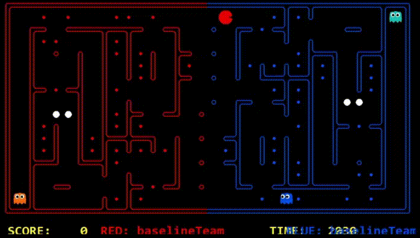

# Evolution of the approach

You can include screenshots of precompetition results and animated gifs, to showcase the evolution of your agents.

## My First Agent - Approach Foo
----

Lorem ipsum dolor sit amet, consectetur adipiscing elit, sed do eiusmod tempor incididunt ut labore et dolore magna aliqua. Ut enim ad minim veniam, quis nostrud exercitation ullamco laboris nisi ut aliquip ex ea commodo consequat. Duis aute irure dolor in reprehenderit in voluptate velit esse cillum dolore eu fugiat nulla pariatur. Excepteur sint occaecat cupidatat non proident, sunt in culpa qui officia deserunt mollit anim id est laborum.

### Demo



#### Competition results: Position - 4/5 | Percentile - 80%


#### Strategy summary

| Pros | Cons |
|-----------------|:-------------|
| First body part | Second cell  |
| Second line     | foo          |
----
## My Second Agent - Approach fOO
----


Lorem ipsum dolor sit amet, consectetur adipiscing elit, sed do eiusmod tempor incididunt ut labore et dolore magna aliqua. Ut enim ad minim veniam, quis nostrud exercitation ullamco laboris nisi ut aliquip ex ea commodo consequat. Duis aute irure dolor in reprehenderit in voluptate velit esse cillum dolore eu fugiat nulla pariatur. Excepteur sint occaecat cupidatat non proident, sunt in culpa qui officia deserunt mollit anim id est laborum.
### Demo


#### Competition results: Position - 21/37 | Percentile - 57%


#### Strategy summary

| Pros | Cons |
|-----------------|:-------------|
| First body part | Second cell  |
| Second line     | foo          |

# Experiments - Reinforcement Learning

## DQN with Tensorflow
Combing deep q learning with neural network
### Motivation  
Pacman contest has the following characteristics: a multiple agent problem, up to 4 agents could be present; information is limited as each agent can only partially observe the map; higher reliance on long term rewards than immediate rewards.
All of which fit the design of Deep Q Network. 

### Implementation  
Tensorflow was used to train the model offline and load it within the 15 seconds initialization period for online prediction. The state of the game was transformed and inputted in to the neural network. Output layer is the size of action space.
```python
model = tf.keras.Sequential([
      Input((self.state_dim,)),
      Dense(32, activation='relu'),
      Dense(32, activation='relu'),
      Dense(self.action_dim, activation=None)
    ])
```
During training, agent would use the model to predict take the best action (exploit). A decaying epsilon is used so the model will randomly pick an legal action sometimes (explore). 
```python
def get_action(self, gameState, legalActions, fallbackAction):
    # ...
    self.epsilon *= EPS_DECAY
    self.epsilon = max(self.epsilon, EPS_MIN)
    
    if np.random.random() < self.epsilon:
      action_index = random.randint(0, len(legalActions) - 1)
      return legalActions[action_index]
    else:
      q_value = self.predict(gameState)[0]
      best = np.argmax(q_value)
      # ....
```
There are 2 networks, q values will be obtained via network one  and the second network, target network contains updates in traning.
Thee weights of the model will be updated after each action is taken. The state, action and reward are saved into a replay buffer.
After maximum steps per episode reached or the game is finished, the agent will randomly sample from replay buffer, predict and train with the model. 
Synchronisation happens after replay where weights in the network one will be used to update target network.

#### *Problems*
The biggest problem for this DQN agent is it doest appear to be learning anything. This is likely due to insufficient training, DQN usually requires training over hundred thousands of episodes. However this is hard to achieve without dedicated hardware such as a GPU for machine learning.
Transforming the gameState into an array or matrix for neural network is problematic since the layout is random in contest. Different approaches experimented, such as only using partially observed maps as input matrix, where each element in the matrix represents an element in the map. However upon inspecting OpenAI GYM, the states used for MsPacman-RAM does not seem to be map elements. 

## DQN with Tensorflow-Agent
Using tensorflow's prebuilt dqn agent 
### Motivation  
Tensorflow Agent contains a collection of prebuilt agents, they can be used out of the box with OpenAI GYM, due to the difference between MsPacman and Berkley Pacman contest, a third party GYM (pacman_gym) was used. Pacman_gym environment is based on berkley pacman. The combination of the two can offer assistance for debugging previous DQN implementation.
Especially on the identifying issues with state transformation and agent implementation.

#### *Problems*
The agent was not able to offer satisfactory result even after training over 5000 episodes.